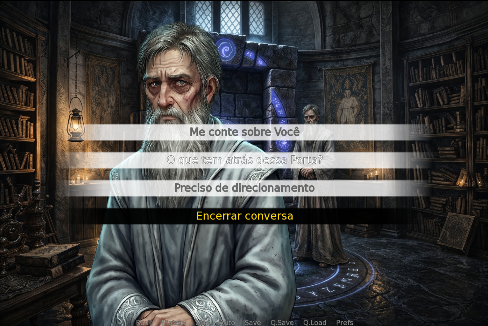
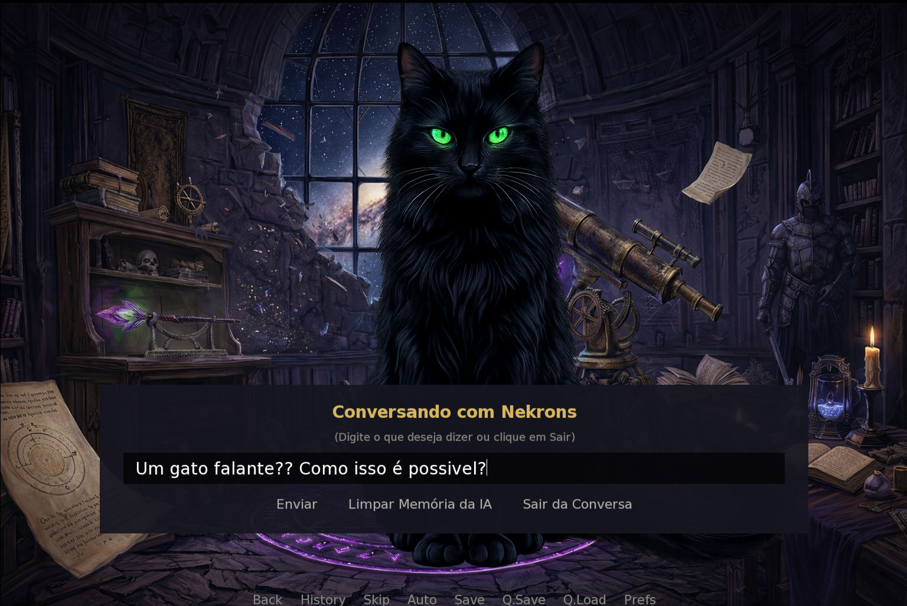
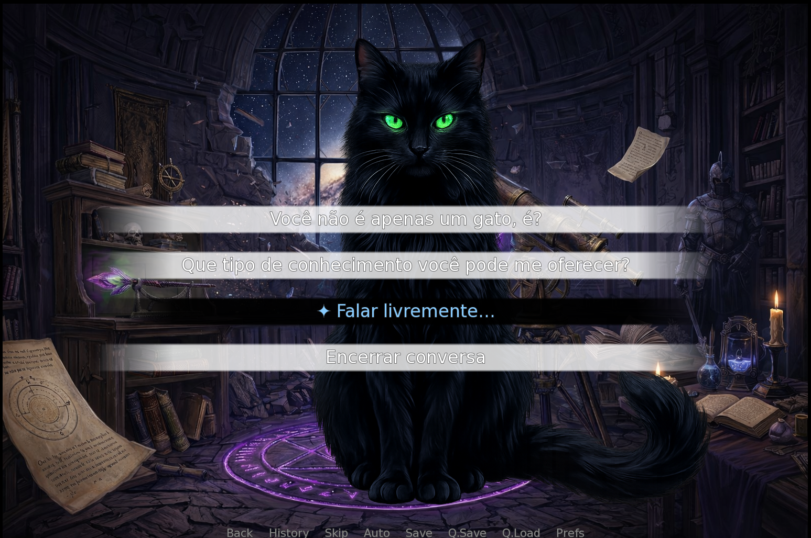

# 🏰 Torre de Aethra — Beyond the Dialog Tree

[](https://www.gnu.org/licenses/gpl-3.0)
[](https://www.renpy.org/)
[](https://ai.google.dev/gemma)
[](https://www.python.org/)

> **Trabalho de Conclusão de Curso (TCC)**
> Caio Cesar Bertarelli Hirata — CESAR School, Graduação em Ciência da Computação

Uma Visual Novel de aventura e mistério desenvolvida em **Ren'Py**, projetada como um experimento acadêmico para investigar o impacto de diferentes modos de diálogo na **imersão do jogador**. O jogo compara três abordagens distintas de interação narrativa — **Pré-Definido**, **Livre (LLM)** e **Híbrido** — coletando métricas de interação em tempo real para análise científica.

Baseado na estrutura original do projeto [Danse Macabre](https://github.com/Taiko3615/Danse-Macabre/tree/main) (a primeira Visual Novel com IA usando ChatGPT), o *Torre de Aethra* expandiu significativamente o conceito original, substituindo a dependência de APIs remotas por um **modelo de linguagem local** (Gemma 3 4B via LM Studio), implementando uma **arquitetura de prompts em 5 camadas** com otimização de KV Cache, e adicionando um modo **Híbrido** inédito que combina diálogos scriptados com texto livre gerado por IA.

---

## 📖 Sumário

- [Proposta Acadêmica](#-proposta-acadêmica)
- [O Jogo](#-o-jogo)
- [Modos de Diálogo](#-modos-de-diálogo)
- [Arquitetura Técnica](#-arquitetura-técnica)
- [Tecnologias Utilizadas](#-tecnologias-utilizadas)
- [Técnicas e Inovações](#-técnicas-e-inovações)
- [Estrutura do Projeto](#-estrutura-do-projeto)
- [Instalação e Execução](#-instalação-e-execução)
- [Sistema de Métricas](#-sistema-de-métricas)
- [Créditos e Referências](#-créditos-e-referências)
- [Licença](#-licença)

---

## 🎓 Proposta Acadêmica

### Problema de Pesquisa

Os sistemas de diálogo em jogos digitais tradicionalmente operam com **árvores de diálogo** — estruturas fixas de escolhas pré-definidas. Embora confiáveis, essas árvores limitam a expressividade do jogador e podem reduzir a sensação de imersão. Com o surgimento de Large Language Models (LLMs), torna-se possível criar NPCs que conversam livremente, mas será que isso realmente melhora a experiência do jogador?

### Objetivo

Este TCC propõe um estudo comparativo da **imersão percebida** pelos jogadores em três modos distintos de interação com NPCs:

| Modo | Descrição |
|------|-----------|
| **Pré-Definido** | Diálogos totalmente scriptados com menus de escolha tradicionais |
| **Livre (LLM)** | Interação por texto livre, com respostas geradas por IA em tempo real |
| **Híbrido** | Combinação: opções pré-definidas disponíveis + campo de texto livre para interagir quando quiser |

### Metodologia

1. O jogador escolhe um dos três modos ao iniciar o jogo
2. A narrativa e o mundo são idênticos em todos os modos — apenas a interface de diálogo muda
3. Métricas quantitativas são coletadas automaticamente (interações por NPC, tempo por ato, tipo de final alcançado)
4. Após o jogo, o jogador responde um questionário de imersão
5. Os dados são cruzados para avaliar correlações entre modo de diálogo e nível de imersão

---

## 🎮 O Jogo

### Sinopse

Você desperta no chão de pedra fria de uma torre misteriosa, sem memórias de como chegou ali. À sua frente, uma **porta selada** que exige uma senha para ser aberta. Ao seu lado, **Eldrin** — um guardião enigmático que parece saber mais do que revela.

Para escapar, você precisará explorar as salas da torre, conversar com seus estranhos habitantes, desvendar segredos antigos e decidir em quem confiar.

### Personagens (NPCs)

| Personagem | Localização | Papel na História |
|------------|-------------|-------------------|
| **Eldrin** 🗡️ | Sala da Porta | Guardião da torre. Distribuidor das chaves e detentor da senha. Opera um sistema de **confiança** (trust) que determina o final. |
| **Skulla** 💀 | Oficina de Alquimia | Crânio falante de um alquimista. Sarcástico e crítico de Eldrin. Fornece a receita da **Poção de Visão Arcana** e sabe que Eldrin invocou o jogador. |
| **Nekrons** 🐱 | Observatório | Gato cósmico místico. Professor de magia que ensina os feitiços (**Lumos**, **Ignis**, **Aqua**, **Revelare**) e guia a ativação da varinha. |
| **Aurelium** 📖 | Biblioteca | Alma de oráculo presa em um grimório flutuante. Memória fragmentada. Sente runas escondidas na estante de pedra e dá dicas sobre a poção. |

### Fluxo de Jogo

```
Ato 1: Despertar → Conhecer Eldrin → Explorar a Sala da Porta
    │
Ato 2: Obter chaves → Visitar Biblioteca, Oficina e Observatório
    │         ├── Aurelium revela → Oficina (Skulla)
    │         ├── Skulla revela → Observatório (Nekrons)
    │         └── Nekrons revela → Biblioteca (Aurelium)
    │
Ato 3: Fabricar Poção de Visão → Lançar feitiços → Abrir Passagem Secreta
    │         └── Ler o Mural de Sangue → Descobrir a verdade sobre Eldrin
    │
Ato 4: Confrontar Eldrin → Fornecer a senha → Final baseado em Confiança
```

### Finais (6 possíveis)

O jogo possui **6 finais** determinados pelo nível de confiança (`eldrin_trust`) acumulado ao longo do jogo:

| Confiança | Ação | Final |
|-----------|------|-------|
| ≤ -1 | Partir | "O Forasteiro foi Expulso" |
| ≤ -1 | Atacar | "Condenado ao Esquecimento" |
| 0–4 | Partir | "O Forasteiro Partiu" |
| 5–7 | Aceitar | "O Forasteiro Entrou em Aethra" |
| ≥ 8 | Aceitar | "O Campeão de Aethra" (épico) |
| ≥ 8 | Recusar | "O Forasteiro Abandonou Aethra" |

---

## 🗣️ Modos de Diálogo

### 1. Modo Pré-Definido (`predef`)

O modo tradicional de Visual Novel. O jogador interage exclusivamente através de **menus de escolha hierárquicos**:

- **Grupos de tópicos** → O jogador escolhe uma categoria (ex: "Me conte sobre Você", "Sobre a magia...")
- **Tópicos individuais** → Dentro do grupo, escolhe o assunto específico
- **Ramificações de resposta** → Algumas falas oferecem opções que alteram a confiança de Eldrin

Tópicos já visitados aparecem em cinza (`{color=#666666}`) para orientar a progressão. Os tópicos são desbloqueados dinamicamente conforme o estado do jogo (itens coletados, NPCs conhecidos, confiança atingida).

### 2. Modo Livre (`livre`)

O jogador digita livremente o que deseja dizer ao NPC. A mensagem é enviada a um **LLM local** (Gemma 3 4B rodando no LM Studio), que responde como o personagem.

Características-chave:
- **Respostas em JSON estruturado**: O LLM retorna um objeto JSON contendo tanto o texto do diálogo quanto chaves booleanas que controlam mecânicas do jogo (ex: `"revealed_final_password": true`)
- **Palavras-chave destacadas**: Termos importantes do jogo (locais, itens, feitiços) são automaticamente destacados em dourado (`{color=#ffd700}`) para auxiliar a navegação narrativa
- **Contexto persistente**: O histórico de conversa é mantido por NPC, permitindo diálogos coerentes ao longo da sessão
- **Reações a eventos**: Cada NPC reage dinamicamente a descobertas do jogador (como a leitura do mural)

### 3. Modo Híbrido (`hibrido`)

A inovação central deste TCC. Combina os dois modos anteriores em uma única interface:

- Os **menus de escolha pré-definidos** continuam disponíveis (idênticos ao modo Pré-Definido)
- Um botão adicional **"✦ Falar livremente..."** permite ao jogador digitar texto livre a qualquer momento
- Quando o jogador usa opções scriptadas, as falas do NPC são **capturadas e injetadas automaticamente no histórico do LLM**, mantendo a coerência entre os dois sistemas

Esta abordagem permite ao jogador escolher o nível de agência desejado em cada momento da conversa, sem perder a consistência narrativa.

### Screenshots dos Modos de Diálogo

| Modo Pré-Definido | Modo Livre (LLM) |
|:--:|:--:|
|  |  |
| Menu de tópicos hierárquico com opções desbloqueáveis | Campo de texto livre com respostas geradas por IA |

| Modo Híbrido | Resposta LLM com Highlight |
|:--:|:--:|
|  |  |
| Opções scriptadas + botão "✦ Falar livremente..." | Palavras-chave do jogo destacadas em dourado |

---

## 🏗️ Arquitetura Técnica

### Visão Geral do Sistema

```
┌──────────────────────────────────────────────────────────┐
│                    CAMADA DE APRESENTAÇÃO                 │
│   screens.rpy │ gui_hud.rpy │ screens_rooms.rpy          │
│   (Menus, HUD, Hotspots Point-and-Click, Inputs)         │
└────────────────────────┬─────────────────────────────────┘
                         │
┌────────────────────────┼─────────────────────────────────┐
│              CAMADA DE LÓGICA DE DIÁLOGO                  │
│                        │                                  │
│   ┌────────────────┐ ┌─┴──────────┐ ┌─────────────────┐  │
│   │  Pré-Definido  │ │   Híbrido  │ │  Livre (LLM)    │  │
│   │  (scriptado)   │ │ (misto)    │ │  (llm_api)      │  │
│   └────────┬───────┘ └─────┬──────┘ └────────┬────────┘  │
│            └───────────────┼─────────────────┘            │
│                            │                              │
│         dialogue_core.rpy (NPC_TOPICS, story_state)       │
│         dialogue_shared.rpy (filtros, unlock logic)       │
│         dialogue_menus.rpy (telas dinâmicas)              │
└────────────────────────┬─────────────────────────────────┘
                         │
┌────────────────────────┼─────────────────────────────────┐
│              CAMADA DE AMBIENTE E GAMEPLAY                 │
│   gameplay_rooms.rpy (salas, feitiços, navegação)         │
│   gameplay_interactions.rpy (interações, 6 finais)        │
└────────────────────────┬─────────────────────────────────┘
                         │
┌────────────────────────┼─────────────────────────────────┐
│              CAMADA DE INFRAESTRUTURA                      │
│   script.rpy (variáveis globais, entrypoint)              │
│   assets.rpy (personagens, imagens)                       │
│   metrics.rpy (analytics → Google Sheets)                 │
│   llm_api/ (cliente HTTP para LLM local)                  │
└──────────────────────────────────────────────────────────┘
```

### Pipeline de Prompts LLM (5 Camadas)

O sistema de prompts foi projetado com uma **arquitetura em 5 camadas**, otimizada para reutilização de KV Cache:

| Camada | Conteúdo | Tipo |
|--------|----------|------|
| **1 — Agente** | Regras de comportamento universais, formato JSON, meta-regras de mecânicas | Estático |
| **2 — Mundo** | Lore do Reino de Aethra, mapa da torre, descrição das salas | Estático |
| **3 — NPC** | Personalidade, backstory, conhecimento e segredos de cada personagem | Estático (por NPC) |
| **4 — Histórico** | Últimas 10 mensagens da conversa (sliding window) | Dinâmico |
| **5 — Contexto Dinâmico** | Regras condicionais ativas, estado do jogo, schema JSON adaptativo | Regenerado a cada turno |

**Otimização de KV Cache**: As camadas 1–3 são inseridas como `system prompt` (cacheável), enquanto a camada 5 é injetada como prefixo da mensagem do jogador, permitindo que o LLM aproveite o cache das camadas estáticas entre turnos.

**Schema JSON Adaptativo**: A camada 5 gera dinamicamente apenas as chaves JSON que ainda não foram resolvidas. Por exemplo, se o jogador já obteve a chave da Oficina, a regra correspondente é removida do prompt — reduzindo a complexidade e o risco de alucinações.

### Roteamento de Diálogos

O sistema usa um **roteador central** que direciona cada conversa para o subsistema correto:

```renpy
label falar_eldrin_porta:
    if dialog_mode == "predef":   jump falar_eldrin_predef
    elif dialog_mode == "livre":  jump falar_eldrin_livre
    elif dialog_mode == "hibrido": jump falar_eldrin_hibrido
```

---

## 🛠️ Tecnologias Utilizadas

| Tecnologia | Versão | Uso no Projeto |
|------------|--------|----------------|
| **[Ren'Py](https://www.renpy.org/)** | 8.x | Engine de Visual Novel. Responsável por toda a renderização, scripting, UI, e empacotamento do jogo. |
| **Python** | 3.12 (embutido no Ren'Py) | Lógica de negócio, parsing de JSON, comunicação HTTP, prompt engineering |
| **[LM Studio](https://lmstudio.ai/)** | — | Servidor local de inferência LLM com API compatível com OpenAI |
| **[Gemma 3 4B](https://ai.google.dev/gemma)** | google/gemma-3-4b | Modelo de linguagem local da Google para geração de diálogos dos NPCs |
| **Google Apps Script** | — | Backend serverless para coleta de métricas via HTTP POST → Google Sheets |
| **OpenAI-Compatible API** | v1 | Protocolo de comunicação entre o jogo e o LM Studio (`/v1/chat/completions`) |

---

## 💡 Técnicas e Inovações

### 1. Saída Estruturada em JSON (Structured Output)

Em vez de texto livre, o LLM é instruído a retornar **exclusivamente objetos JSON válidos**. Cada resposta contém:
- `"dialogo"`: O texto que o NPC fala
- Chaves booleanas de mecânica: controlam eventos do jogo (ex: `"trust_change"`, `"revealed_final_password"`)

Isso permite que a IA controle mecânicas do jogo (entregar chaves, revelar segredos, alterar confiança) de forma determinística, mantendo a coerência narrativa.

### 2. Injeção de Histórico no Modo Híbrido

Quando o jogador usa opções scriptadas no modo Híbrido, o sistema:
1. Captura as falas do NPC geradas pelo script
2. Injeta-as no histórico de chat do LLM como mensagens `assistant`
3. Garante que, ao alternar para texto livre, o LLM saiba o que já foi dito

### 3. Schema JSON Adaptativo

O prompt da camada 5 **adapta o schema JSON em tempo real** de acordo com o estado do jogo, removendo chaves já resolvidas e injetando informações sensíveis apenas quando desbloqueadas.

### 4. Sistema de Confiança (Trust System)

As escolhas do jogador nos diálogos com Eldrin alteram um valor numérico de confiança (`eldrin_trust`), que determina qual dos 6 finais o jogador receberá. No modo Livre, o LLM controla alterações de confiança via JSON.

### 5. Tratamento Gracioso de Falhas

Quando o LLM falha (timeout, erro de parsing), o sistema exibe mensagens **in-character** em vez de erros técnicos. Ex: *"A mente de [NPC] parece fragmentada por um instante..."*

### 6. Log de Conversas com Destaque Visual

Um diário de conversas acessível pelo HUD registra todas as interações. No modo Livre, **palavras-chave do jogo** (locais, itens, feitiços) são destacadas em dourado para auxiliar o jogador a identificar informações importantes.

---

## 📁 Estrutura do Projeto

```
beyond_the_dialog_tree/
│
├── game/
│   ├── core/                           # Núcleo do sistema
│   │   ├── script.rpy                  # Variáveis globais, entrypoint, seleção de modo
│   │   ├── assets.rpy                  # Personagens, imagens, sistema de log
│   │   ├── dialogue_core.rpy           # Motor de diálogos: NPC_TOPICS, story_state
│   │   └── metrics.rpy                 # Classe GameMetrics, envio para Google Sheets
│   │
│   ├── dialogue/                       # Subsistemas de diálogo
│   │   ├── dialogue_shared.rpy         # Filtros de desbloqueio, avaliação de tópicos
│   │   ├── dialogue_menus.rpy          # Telas dinâmicas de menu (predefinido + híbrido)
│   │   ├── predefined/
│   │   │   └── dialogues_npcs_predefined.rpy   # Diálogos 100% scriptados
│   │   ├── free_llm/
│   │   │   ├── dialogues_npcs_livre.rpy        # Loop de diálogo livre + parser JSON
│   │   │   └── llm_prompts.rpy                 # Engenharia de prompts (5 camadas)
│   │   └── hybrid/
│   │       └── dialogues_npcs_hibrido.rpy      # Modo híbrido (scriptado + livre)
│   │
│   ├── environment/                    # Lógica de cenário e gameplay
│   │   ├── gameplay_rooms.rpy          # Salas, feitiços, navegação
│   │   └── gameplay_interactions.rpy   # Interações, senha, 6 finais
│   │
│   ├── gui_custom/                     # Interface personalizada
│   │   ├── gui_hud.rpy                 # HUD (mapa, diário, varinha)
│   │   └── screens_rooms.rpy           # Hotspots point-and-click, inputs
│   │
│   ├── python-packages/
│   │   └── llm_api/                    # Cliente HTTP para LLM (OpenAI-compatible)
│   │
│   ├── images/                         # Assets visuais (backgrounds, sprites, ícones)
│   ├── audio/                          # Efeitos sonoros e música de menu
│   ├── gui/                            # Assets padrão do Ren'Py (botões, barras)
│   ├── screens.rpy                     # Telas padrão do Ren'Py
│   ├── gui.rpy                         # Configurações visuais do Ren'Py
│   └── options.rpy                     # Metadados do projeto
│
├── LICENSE                             # GPL v3
└── README.md                           # Este arquivo
```

---

## 🚀 Instalação e Execução

### Pré-requisitos

- **[Ren'Py SDK](https://www.renpy.org/latest.html)** (versão 8.x ou superior)
- **[LM Studio](https://lmstudio.ai/)** (para os modos Livre e Híbrido)
- **Modelo Gemma 3 4B** (baixar dentro do LM Studio: `google/gemma-3-4b`)

### Passo a Passo

#### 1. Clonar o repositório

```bash
git clone https://github.com/Kal-0/beyond_the_dialog_tree.git
```

#### 2. Configurar o LM Studio (necessário apenas para modos Livre/Híbrido)

1. Abra o LM Studio
2. Baixe o modelo `google/gemma-3-4b`
3. Carregue o modelo e inicie o servidor local
4. Verifique que o servidor está rodando em `http://127.0.0.1:1234`

> **Nota:** O modo Pré-Definido funciona sem o LM Studio. Se você quiser apenas testar o jogo com diálogos scriptados, pule este passo.

#### 3. Executar o jogo

1. Abra o **Ren'Py Launcher**
2. Clique em **"Projects"** → Navegue até a pasta `beyond_the_dialog_tree`
3. Clique em **"Launch Project"**

#### 4. (Opcional) Gerar executável para distribuição

1. No Ren'Py Launcher, selecione o projeto
2. Clique em **"Build Distributions"**
3. Marque as plataformas desejadas (Windows, Linux, Mac)
4. Clique em **"Build"**

### Configuração do Modelo LLM

O arquivo de configuração do LLM está em `game/python-packages/llm_api/__init__.py`:

```python
llm_config = {
    "provider": "lmstudio",
    "base_url": "http://127.0.0.1:1234/v1/chat/completions",
    "model": "google/gemma-3-4b",
    "api_key": "lm-studio"
}
```

Para usar um modelo ou provedor diferente, basta alterar esses valores. Qualquer API compatível com o protocolo OpenAI (`/v1/chat/completions`) é suportada.

---

## 📊 Sistema de Métricas

O jogo coleta automaticamente dados quantitativos para a pesquisa acadêmica:

### Dados Coletados

| Métrica | Descrição |
|---------|-----------|
| `email` | Identificador do participante |
| `modo_jogo` | Modo de diálogo selecionado (predef/livre/hibrido) |
| `final_escolhido` | Nome do final alcançado |
| `eldrin_trust_final` | Valor final de confiança com Eldrin |
| `interacoes_dialogo_ato1..4` | Quantidade de falas por ato |
| `interacoes_gameplay_ato1..4` | Quantidade de ações de gameplay por ato |
| `interacoes_eldrin/skulla/nekrons/aurelium` | Falas por NPC |
| `tempo_ato1..4` | Tempo gasto em cada ato (segundos) |
| `tempo_total` | Tempo total de jogo |

### Envio dos Dados

As métricas são enviadas automaticamente ao final do jogo via HTTP POST para um **Google Apps Script** que registra os dados em uma planilha do Google Sheets. O envio ocorre em uma thread separada para não interferir na experiência do jogador.

---

## 📚 Créditos e Referências

### Projeto Base

Este projeto foi construído sobre a estrutura do **[Danse Macabre](https://github.com/Taiko3615/Danse-Macabre)** por [Taiko3615](https://github.com/Taiko3615), descrito como *"The first AI Powered Visual Novel using Chat GPT"*. A partir dessa base, o *Torre de Aethra* foi substancialmente redesenhado com:
- Narrativa original completa (lore, personagens, puzzles)
- Migração de API remota (ChatGPT) para modelo local (Gemma 3 4B / LM Studio)
- Implementação do modo Híbrido (inexistente no original)
- Sistema de prompts em 5 camadas com otimização de cache
- Sistema de métricas acadêmicas integrado
- Saída estruturada em JSON com controle de mecânicas

### Autor

**Caio Cesar Bertarelli Hirata**
CESAR School — Graduação em Ciência da Computação

### Motor do Jogo

**[Ren'Py](https://www.renpy.org/)** — Copyright © 2004-2024 Tom Rothamel. Licenciado sob MIT.

---

## 📄 Licença

Este projeto é distribuído sob a licença **GNU General Public License v3.0**.
Consulte o arquivo [LICENSE](LICENSE) para mais detalhes.
